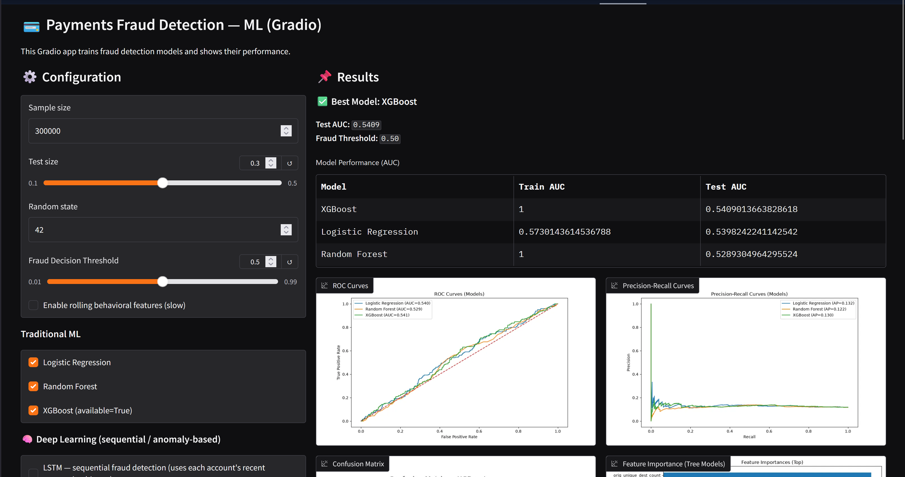
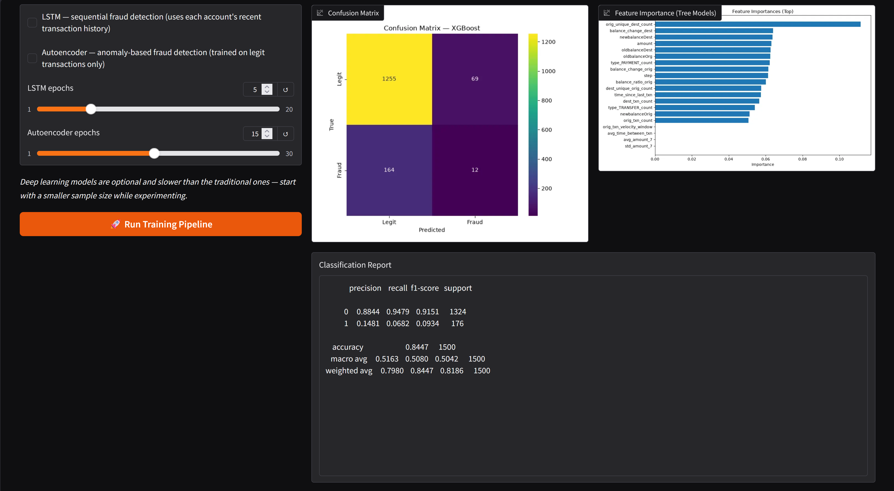
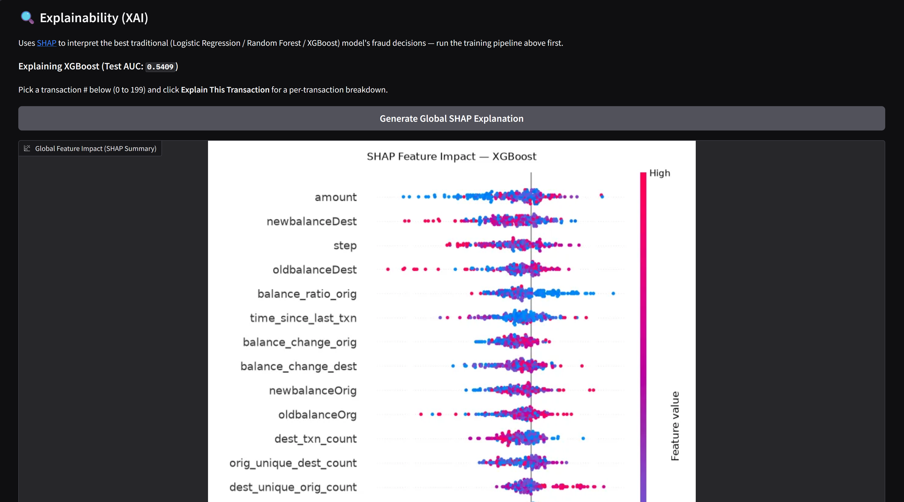
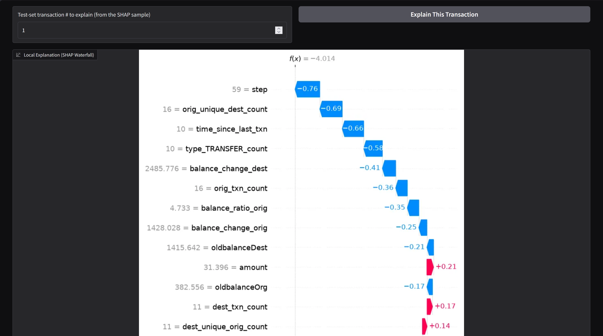
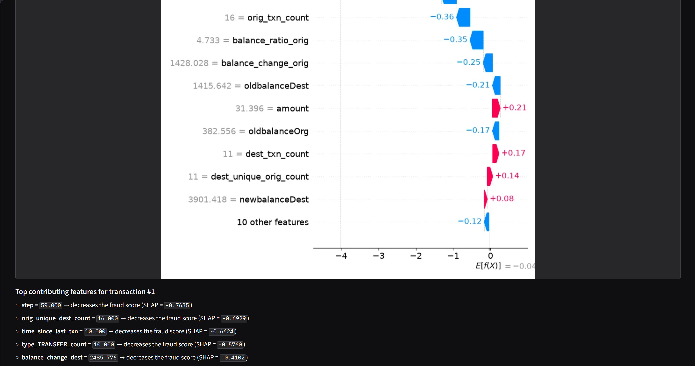

# Payments Fraud Detection

# Gradio App (with link)

https://huggingface.co/spaces/bytayo/payments-fraud-detection

---
## 📃 Table of Contents

1. Project Overview
2. Files
3. Tools & Libraries
4. Keynotes
5. Future Improvements

---

## 📘 Project Overview

This project focuses on detecting fraudulent payment transactions using machine learning and data visualization. By analyzing transaction logs, the project applies classification models to distinguish between legitimate and fraudulent payments. Additionally, it provides visual insights into fraud patterns and risk indicators.

The objectives are:

* Build predictive models for fraud detection.
* Explore data visualizations to uncover hidden fraud patterns.
* Evaluate model performance to balance accuracy and recall (minimizing false negatives).

---

## 📂 Files
* `Payments_Visualizations.ipynb` – Jupyter Notebook with data preprocessing, model training, fraud detection, and visualization workflow.
* `core.py` – Data loading, behavioral feature engineering, traditional ML training, plotting, and SHAP explainability helpers.
* `deep_models.py` – PyTorch LSTM (sequential fraud detection) and Autoencoder (anomaly-based fraud detection) models.
* `app.py` – Gradio dashboard/API tying it all together (also deployed to Hugging Face Spaces, see link above).

---

⚙️ Tools & Libraries

* Python
* Pandas / NumPy – Data preprocessing and feature transformation.
* Scikit-learn – Logistic Regression, Random Forest, SVM, evaluation metrics.
* XGBoost – Gradient boosting classifier for fraud detection.
* PyTorch – LSTM sequence model and Autoencoder anomaly detector for deep-learning-based fraud detection.
* SHAP – Explainable AI (XAI): global and per-transaction interpretation of fraud classification decisions.
* Gradio – Interactive dashboard, deployed with an auto-generated REST API (see "Using the API" below).
* Matplotlib / Seaborn – Data visualization (class distribution, feature analysis, confusion matrix).

---

## 📝 Keynotes

* Preprocessed payment transaction data, handling missing values and preparing features for modeling.
  
* Built and compared multiple classification models, including:
  - Logistic Regression
  - Support Vector Machine (SVM)
  - Random Forest Classifier
  - XGBoost Classifier

* Evaluated models using key performance metrics:
  - Accuracy
  - Precision, Recall, F1-score
  - ROC-AUC score

* Visualized fraud detection insights through:
  - Transaction amount distributions (fraud vs. legitimate)
  - Correlation heatmaps of transaction features
  - Feature importance rankings (tree-based models)
  - Confusion matrices for model performance interpretation

* Added deep learning models for sequential and anomaly-based fraud detection:
  - **LSTM** — trained on each account's recent transaction history (a sliding window of past transactions) to catch fraud patterns that unfold over a sequence, not just a single row.
  - **Autoencoder** — trained only on legitimate transactions; transactions it reconstructs poorly (high reconstruction error) are flagged as anomalous / likely fraud.

* Enhanced behavioral feature engineering with frequency and velocity signals:
  - Per-account transaction counts and rolling transaction frequency
  - Time-since-last-transaction and average time between transactions
  - Transaction velocity within a recent time window
  - Fan-out / fan-in counts (unique destinations per sender, unique senders per destination)
  - Rolling average/std/max transaction amount, amount deviation and ratio vs. an account's own baseline

* Added explainable AI (XAI) with SHAP:
  - Global feature-impact summary plot for the best-performing traditional model
  - Per-transaction waterfall plots and plain-language "why was this flagged" breakdowns

* Deployed as an interactive **Gradio dashboard** (see link above) with an **auto-generated REST API** — every action in the app (training, SHAP explanations) is callable programmatically. From a running instance, see `<space-or-local-url>/?view=api` for the full API docs and example client code.

---
## Images/Screenshots of the Work

---

## 🚀 Future Improvements

* Apply real-time streaming detection with Apache Kafka or AWS Kinesis.
* Extend SHAP/XAI coverage to the deep learning models (e.g. via `DeepExplainer` or attention-based interpretability for the LSTM).
* Add automated hyperparameter tuning (e.g. Optuna) for both traditional and deep learning models.
